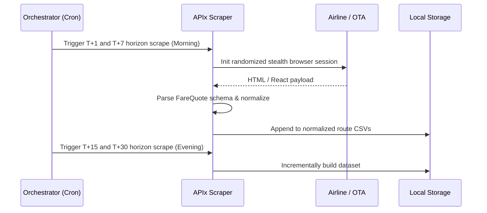

# APIx: Real-time Airfare Price Index

> Modernizing India's official inflation number (CPI) through smart automation and real-time scraping.


India’s official inflation number treats airfares like it’s still 2005. The current methodology relies on manual price checks a few times a month, despite prices swinging by 300% in a single day and 90% of bookings happening online. 

**APIx** fixes this. It is a resilient, automated data pipeline that continuously scrapes dynamic fare data from major airlines (IndiGo, SpiceJet), normalizes it, and constructs a statistically rigorous, DGCA-weighted price index. It completely replaces manual surveys with a real-time, automated data feed for the MoSPI and RBI.

**demo:** [Video link pending / insert here]

## How It Works



## Architecture

```mermaid
graph TD
    subgraph Data Acquisition Layer
        I(IndiGo Stealth Scraper)
        S(SpiceJet Scraper)
    end
    
    subgraph Storage & Normalization
        C[(Route-specific CSVs)]
    end
    
    subgraph Processing Engine (Future Scope)
        E[Cleaning & Outlier Removal]
        IDX[Laspeyres-style Index Engine]
    end

    I -- Appends --> C
    S -- Appends --> C
    C --> E
    E --> IDX
```

## Installation

```bash
# Clone the repository
git clone https://github.com/your-username/apix.git
cd apix

# Install the required Python dependencies
pip install undetected-chromedriver pandas selenium

# Run the IndiGo scraper (defaults to all horizons)
python3 indigo/indigo_scraper_uc.py

# Run the SpiceJet scraper for specific scheduled windows (e.g., T+1 and T+7)
python3 spicejet/spicejet_scraper.py --windows 1,7
```

## Environment Variables

| Variable | Required | Default | Description |
|---|---|---|---|
| None | No | - | The MVP relies strictly on local execution and headless browsers without external API keys. |

## Core Features

| Feature | Description |
|---|---|
| **Stealth Automation** | Uses `undetected-chromedriver` with randomized User-Agents and precise event bubbling to bypass strict Akamai/Cloudflare bot mitigations. |
| **Intelligent Rate Limiting** | Scrapes are orchestrated via a chunking schedule (e.g., `--windows 1,7`) combined with jittered delays (30-45s) to stay under the 15-request WAF thresholds. |
| **Standardized Schema** | Parses disparate HTML structures (React Synthetic events for IndiGo, standard DOM for SpiceJet) into a single, unified `FareQuote` dataclass. |
| **Horizon-First Architecture** | Prioritizes scraping time-critical T+1 windows across all locations *before* attempting longer-term horizons, guaranteeing critical data capture. |

## How to Test

1. Open your terminal in the root directory.
2. We want to test scraping the most critical window (T+1) for SpiceJet to verify the parser works without burning rate limits. Run:
   ```bash
   python3 spicejet/spicejet_scraper.py --windows 1
   ```
3. Observe the terminal. The scraper will launch a window, navigate to SpiceJet, and extract the economy, flex, and business tier prices.
4. Open `spicejet/apix_spicejet_del_bom_raw_uc.csv`. You will see the structured data appended to the file, perfectly formatted for Pandas consumption.

## Security & Disclaimers

- **Legal & Ethical Scraping:** The system relies on scraping publicly available fare data. We strictly rate-limit the system to <15 queries per hour per IP to avoid disrupting the airlines' service.
- **Data Persistence:** The scrapers use `append` operations for file writing to ensure transient browser crashes (e.g., out of memory errors) do not destroy historical data.

## Why APIx?

| Metric | Manual CPI Survey (Legacy) | Private Aggregators | APIx (Our Solution) |
|---|---|---|---|
| **Data Frequency** | Monthly / Weekly | Real-time | Real-time (Daily automated) |
| **Cost** | High (Human labor) | Extremely High (B2B API access) | Near Zero (Compute cost only) |
| **Granularity** | Low (Aggregated routes) | Consumer-focused | High (T+1, T+7, T+30 horizons) |
| **Govt Compatibility** | Native | Proprietary / Closed Box | Open Schema, DGCA-aligned |

## Roadmap

**Now**
- Complete stealth scraping for LCCs (IndiGo, SpiceJet).
- Standardize data schema across platforms and build schedule architecture.

**Next**
- Integrate OTAs (MakeMyTrip, EaseMyTrip) to capture full-service carrier availability (Air India, Vistara).
- Construct the actual Laspeyres-style index computation engine weighted by DGCA route traffic.

**Future**
- Build an automatic LLM-powered DOM parser that self-heals when airlines push UI updates.
- Create a visual dashboard for MoSPI statisticians to track route heatmaps and inflation curves.

## Tech Stack & License

- **Python 3.11+**
- **undetected-chromedriver** (Bypassing WAFs)
- **Selenium** (DOM manipulation and React event simulation)
- **Pandas** (Data analysis)

### License
MIT License. Copyright (c) 2024 APIx Team.
