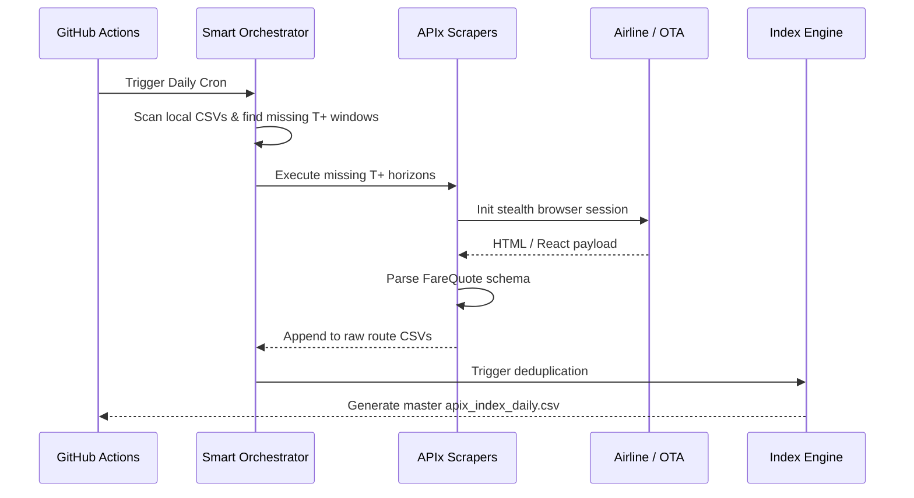
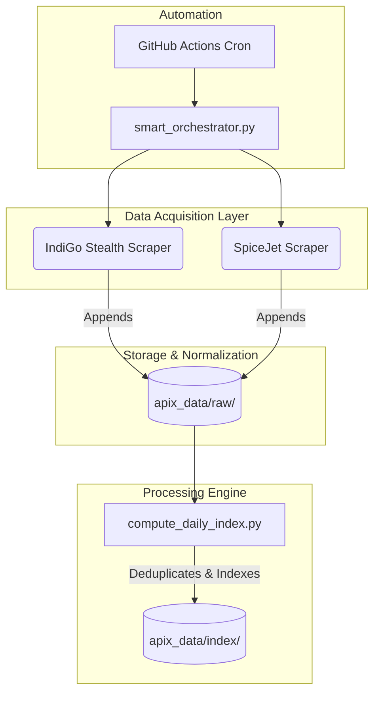

# APIx: Real-time Airfare Price Index

> Modernizing India's official inflation number (CPI) through smart automation and real-time scraping.


India’s official inflation number treats airfares like it’s still 2005. The current methodology relies on manual price checks a few times a month, despite prices swinging by 300% in a single day and 90% of bookings happening online. **APIx** fixes this. It is a resilient, automated data pipeline that continuously scrapes dynamic fare data from major airlines (IndiGo, SpiceJet), normalizes it, and constructs a statistically rigorous, DGCA-weighted price index. It completely replaces manual surveys with a real-time, automated data feed for the MoSPI and RBI.

**demo:** [Video link pending / insert here]

## How It Works



## Architecture



## Installation

```bash
# Clone the repository
git clone https://github.com/your-username/apix.git
cd apix

# Install the required Python dependencies
pip install -r requirements.txt
# OR
pip install undetected-chromedriver pandas selenium

# Run the smart orchestrator to automatically detect and scrape missing data for today
python3 smart_orchestrator.py

# Manually compute the daily index from raw files
python3 compute_daily_index.py
```

## Environment Variables

| Variable | Required | Default | Description |
|---|---|---|---|
| None | No | - | The MVP relies strictly on local/GitHub execution and headless browsers without external API keys. |

## Core Features

| Feature | Description |
|---|---|
| **State-Aware Orchestrator** | `smart_orchestrator.py` scans what data is missing for the day and runs exactly what's needed, making the system immune to cron delays or temporary failures. |
| **Stealth Automation** | Uses `undetected-chromedriver` with randomized delays and precise event bubbling to bypass strict Akamai/Cloudflare bot mitigations. |
| **Automated Data Pipeline** | Raw CSVs are automatically merged, filtered (removing sold-out flights), and deduplicated daily via `compute_daily_index.py`. |
| **Standardized Schema** | Parses disparate HTML structures (React Synthetic events for IndiGo, standard DOM for SpiceJet) into a single, unified canonical schema. |

## Live Demo / How to Test

1. Open your terminal in the root directory.
2. We want to test the smart orchestration system. Run:
   ```bash
   python3 smart_orchestrator.py
   ```
3. Observe the terminal. If you haven't scraped today, the script will calculate the missing `T+1` to `T+45` windows and automatically launch the scrapers for IndiGo and SpiceJet.
4. Once completed, run the index compiler:
   ```bash
   python3 compute_daily_index.py
   ```
5. Check `apix_data/index/apix_index_daily.csv` to see your master deduplicated dataset, perfectly formatted for Pandas consumption!

## Security & Disclaimers

- **Delay & Failure Resiliency:** Our GitHub Actions pipeline relies on a state-aware Python script rather than bash time-checking, ensuring robust recovery from GitHub runner delays.
- **Data Persistence:** The scrapers use `append` operations for file writing to ensure transient browser crashes do not destroy historical data.
- **Ethical Scraping:** The system respects server load by scraping statically defined time horizons once a day per carrier.

## Comparison Table

| Metric | Manual CPI Survey (Legacy) | Private Aggregators | APIx (Our Solution) |
|---|---|---|---|
| **Data Frequency** | Monthly / Weekly | Real-time | Real-time (Daily automated) |
| **Cost** | High (Human labor) | Extremely High (B2B API access) | Near Zero (Compute cost only) |
| **Granularity** | Low (Aggregated routes) | Consumer-focused | High (T+1, T+7, T+15, T+30, T+45) |
| **Govt Compatibility** | Native | Proprietary / Closed Box | Open Schema, DGCA-aligned |

## Roadmap

**Now**
- Complete stealth scraping for LCCs (IndiGo, SpiceJet).
- Build the `smart_orchestrator.py` and `compute_daily_index.py` automated GitHub Actions pipeline.

**Next**
- Integrate OTAs (MakeMyTrip, EaseMyTrip) to capture full-service carrier availability (Air India, Vistara).
- Implement IQR outlier removal to filter out glitch fares.

**Future**
- Add Laspeyres-style index computation weighted by DGCA route traffic.
- Create a visual dashboard for MoSPI statisticians to track route heatmaps and inflation curves.

## Tech Stack & License

- Python 3.11+
- undetected-chromedriver (Bypassing WAFs)
- Selenium (DOM manipulation and React event simulation)
- Pandas (Data analysis)
- GitHub Actions (CI/CD Pipeline)

### License
MIT License. Copyright (c) 2026 APIx Team.
