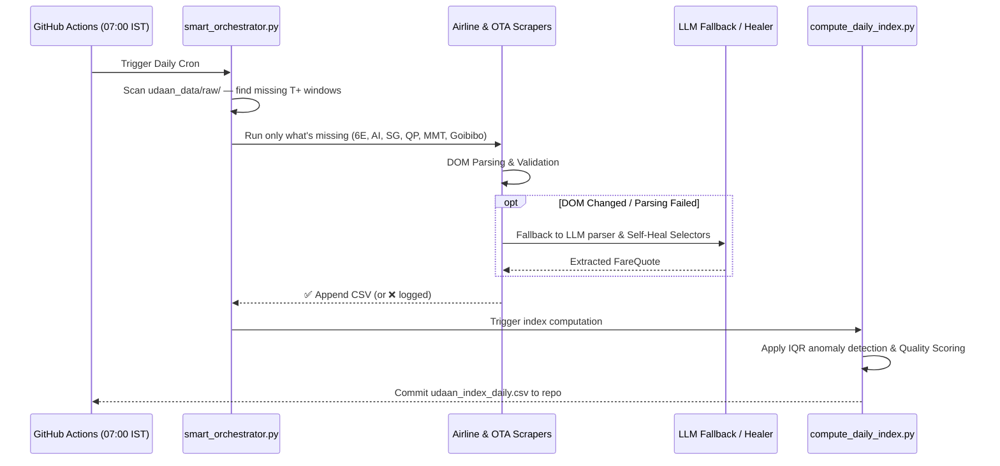
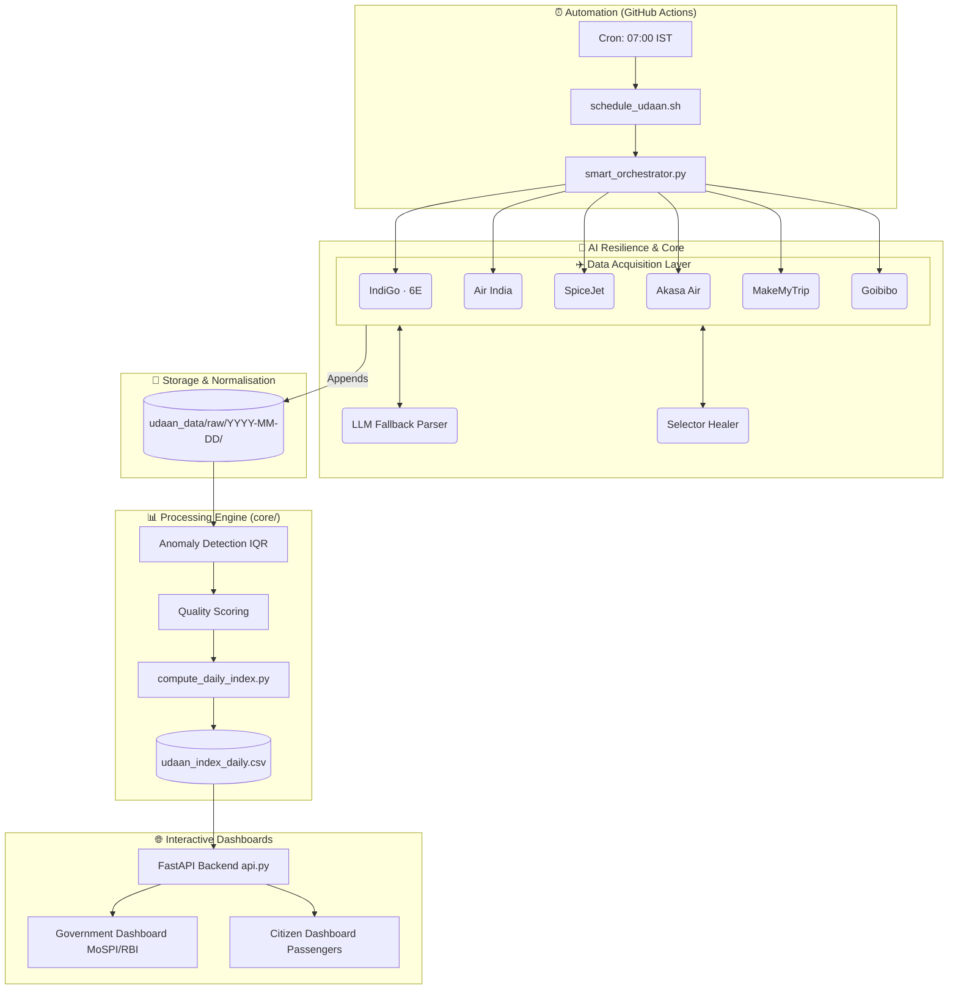

# Udaan Metrics — Real-time Airfare Price Index

> Modernising India's official inflation number (CPI) through smart automation, real-time scraping, and AI-driven resilience.


India's official inflation number treats airfares like it's still 2005. The current methodology relies on manual price checks a few times a month, despite prices swinging by 300% in a single day and 90% of bookings happening online. **Udaan Metrics** fixes this — a resilient, automated data pipeline that scrapes live fare data from **4 major Indian airlines** (IndiGo, Air India, SpiceJet, Akasa Air) and **2 major OTAs** (MakeMyTrip, Goibibo). It normalises it into a unified schema, removes anomalies, and computes a statistically rigorous, DGCA-weighted price index. 

Udaan Metrics provides dual interactive dashboards: a **Government Panel** for MoSPI/RBI statisticians to track inflation and an **OTA Premium KPI**, alongside a **Citizen Dashboard** to help passengers make data-driven booking decisions.

---

## How It Works



---

## Architecture



---

## Repo Structure

```text
SIH/
├── core/
│   ├── anomaly_detection.py       # IQR-based outlier rejection
│   ├── fare_index.py              # DGCA-weighted composite index & OTA Premium
│   ├── forecasting.py             # Prophet-based time-series prediction
│   ├── llm_fallback_parser.py     # Gemini AI fallback for broken scrapers
│   ├── quality_scoring.py         # Data grading (A/B/C) based on completeness
│   ├── selector_healer.py         # Auto-generates updated DOM selectors
│   └── fare_schema.py             # Canonical 18-column FareQuote Dataclass
├── frontend/                      # React & Vite Presentation Layer
│   ├── src/components/gov/        # MoSPI/RBI Statistician Dashboards
│   └── src/components/citizen/    # Passenger Booking Indicators
├── udaan_data/                     # Raw CSV logs & master indexes
├── *_scraper.py                   # Airline & OTA Specific Scrapers (6 total)
├── smart_orchestrator.py          # State-aware runner & circuit breakers
├── compute_daily_index.py         # Merges raw CSVs → daily index
├── api.py                         # FastAPI Backend
└── demo/chaos_test.py             # Sandbox to simulate scraper DOM failures
```

---

## Supported Sources

| Source | Type | Scraper Engine | Routes |
|---|---|---|---|
| IndiGo (`6E`) | Airline | SeleniumBase UC | DEL-BOM, DEL-BLR, BOM-BLR, DEL-CCU, BLR-HYD, MAA-DEL |
| Air India (`AI`) | Airline | SeleniumBase UC | DEL-BOM, DEL-BLR, BOM-BLR, DEL-CCU, BLR-HYD, MAA-DEL |
| SpiceJet (`SG`) | Airline | undetected-chromedriver | DEL-BOM, DEL-BLR, BOM-BLR, DEL-CCU, BLR-HYD, MAA-DEL |
| Akasa Air (`QP`) | Airline | undetected-chromedriver | DEL-BOM, DEL-BLR, BOM-BLR, DEL-CCU, BLR-HYD, MAA-DEL |
| MakeMyTrip | OTA | undetected-chromedriver | DEL-BOM, DEL-BLR, BOM-BLR, DEL-CCU, BLR-HYD, MAA-DEL |
| Goibibo | OTA | undetected-chromedriver | DEL-BOM, DEL-BLR, BOM-BLR, DEL-CCU, BLR-HYD, MAA-DEL |

All scrapers collect **5 advance-purchase horizons**: `T+1`, `T+7`, `T+15`, `T+30`, `T+45`.

---

## Installation

```bash
# 1. Clone
git clone https://github.com/Rishavroy-2006/Udaan Metrics.git
cd Udaan Metrics

# 2. Install dependencies
pip install undetected-chromedriver seleniumbase selenium pandas beautifulsoup4 lxml fastapi uvicorn google-genai

# 3. Run the orchestrator (auto-detects what's missing for today)
python3 smart_orchestrator.py

# 4. Compute the daily index
python3 compute_daily_index.py

# 5. Start the backend API
uvicorn api:app --reload --port 8000

# 6. Start the frontend dashboard (in a new terminal)
cd frontend
npm install
npm run dev
```

---

## Core Features

| Feature | Detail |
|---|---|
| **AI LLM Fallback & Healer** | If a website updates its DOM and breaks the scraper, Udaan Metrics seamlessly falls back to Gemini LLM to parse the HTML, and automatically generates updated JSON selectors for the next run. |
| **Dual Dashboards** | `Government Dashboard` (macroeconomic tracking, inflation curves, anomalies) and `Citizen Dashboard` (booking signals, trajectory charts). |
| **OTA Premium Indexing** | Tracks the dynamic margin (markup/markdown) between direct airline fares and OTA aggregators in real-time. |
| **Anomaly Detection** | Applies statistical IQR (Interquartile Range) validation to detect and filter out pricing glitches before they corrupt the master index. |
| **State-Aware Orchestrator** | Scans `udaan_data/raw/` to find exactly which T+ windows are missing — never re-scrapes what already exists. |
| **Prophet Forecasting** | Uses time-series modeling to project airfare inflation trends up to 30 days into the future. |
| **Chaos Testing Demo** | Includes an interactive CLI (`demo/chaos_test.py`) to actively simulate airline website changes and watch the system self-heal in real time. |

---

## Canonical CSV Schema

All scrapers output **exactly** this 18-column schema (`docs/GUIDELINES.md` is the binding reference):

| Column | Type | Example |
|---|---|---|
| `origin` | IATA (3-char) | `DEL` |
| `destination` | IATA (3-char) | `BOM` |
| `carrier_code` | 2-char | `6E`, `AI`, `IX`, `SG`, `QP` |
| `carrier_name` | String | `IndiGo`, `Air India`, … |
| `flight_num` | String | `6E 2034`, `AI 865` |
| `travel_date` | YYYY-MM-DD | `2026-09-02` |
| `advance_purchase_days` | Integer | `1`, `7`, `15`, `30`, `45` |
| `fare_class` | String | `economy`, `business` |
| `base_fare` | Float / null | `5800.0` |
| `taxes_and_fees` | Float / null | `933.0` |
| `total_fare` | Float / null | `6733.0` |
| `fare_split_estimated` | Boolean | `false` |
| `departure_time` | HH:MM | `08:55` |
| `status` | Enum | `ok`, `sold_out`, `parse_error`, `no_flights` |
| `scraped_at` | ISO-8601 + TZ | `2026-09-01T07:00:00+05:30` |
| `capture_run` | String | `2026-09-01_0700IST` |
| `source` | Enum | `airline_direct`, `ota` |
| `source_name` | String | `MakeMyTrip`, `IndiGo` |

---

## Roadmap & Completion

**Done ✅**
- Stealth scraping for 4 domestic carriers and 2 major OTAs.
- AI LLM Fallback parsing and self-healing selector registry.
- `smart_orchestrator.py` with state-aware skip logic, validation, and circuit breakers.
- `compute_daily_index.py` automated merge & IQR anomaly rejection pipeline.
- Quality Scoring & Data Grading (A, B, C based on coverage).
- Prophet forecasting for 30-day forward-looking index predictions.
- FastAPI backend serving the computed daily index and historical trends.
- React/Vite Dual Dashboard with route heatmaps, inflation curves, booking signals, and OTA Premium KPI.
- Canonical 18-column schema, `docs/GUIDELINES.md` + `docs/SCRAPING_RULES.md`.

**Future**
- Laspeyres-style index computation weighted by exact passenger volumes from DGCA.

---

### License
MIT License. Copyright © 2026 Udaan Metrics Team.
