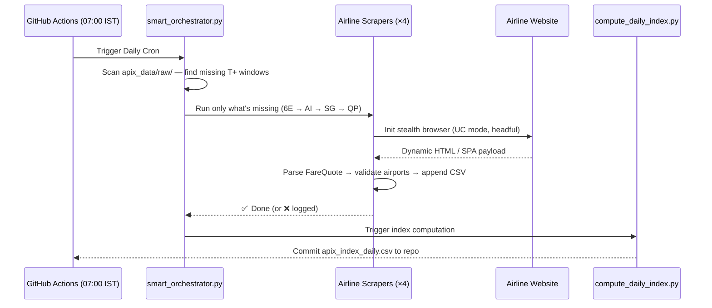

# APIx — Real-time Airfare Price Index

> Modernising India's official inflation number (CPI) through smart automation and real-time scraping.


India's official inflation number treats airfares like it's still 2005. The current methodology relies on manual price checks a few times a month, despite prices swinging by 300% in a single day and 90% of bookings happening online. **APIx** fixes this — a resilient, automated data pipeline that scrapes live fare data from **4 major Indian airlines** (IndiGo, Air India, SpiceJet, Akasa Air), normalises it into a unified schema, and computes a statistically rigorous, DGCA-weighted price index. It completely replaces manual surveys with a real-time, automated data feed for MoSPI and RBI.

---

## How It Works



---

## Architecture

```mermaid
graph TD
    subgraph Automation ["⏰ Automation (GitHub Actions)"]
        GA[Cron: 07:00 IST] --> SH[schedule_apix.sh]
        SH --> SO[smart_orchestrator.py]
    end

    subgraph Scrapers ["✈️ Data Acquisition Layer"]
        SO --> I(IndiGo · 6E)
        SO --> AI(Air India · AI / IX)
        SO --> S(SpiceJet · SG)
        SO --> AK(Akasa Air · QP)
    end

    subgraph Storage ["💾 Storage & Normalisation"]
        I  -- Appends --> RAW[(apix_data/raw/YYYY-MM-DD/)]
        AI -- Appends --> RAW
        S  -- Appends --> RAW
        AK -- Appends --> RAW
    end

    subgraph Processing ["📊 Processing Engine"]
        RAW --> CDI[compute_daily_index.py]
        CDI --> IDX[(apix_data/index/apix_index_daily.csv)]
    end

    subgraph API_UI ["🌐 Presentation Layer"]
        IDX --> API[FastAPI Backend (api.py)]
        API --> UI[React/Vite Frontend Dashboard]
    end
```

---

## Repo Structure

```
SIH/
├── indigo/
│   └── indigo_scraper_uc.py       # IndiGo (6E) — SeleniumBase UC mode
├── air_india/
│   └── air_india_scraper.py       # Air India (AI/IX) — SeleniumBase UC mode
├── spicejet/
│   └── spicejet_scraper.py        # SpiceJet (SG) — undetected-chromedriver
├── akasa/
│   └── akasa_scraper.py           # Akasa Air (QP) — undetected-chromedriver
├── apix_data/
│   ├── raw/YYYY-MM-DD/            # One canonical CSV per carrier per run
│   └── index/                     # apix_index_daily.csv (master deduplicated)
├── docs/
│   ├── GUIDELINES.md              # Canonical data schema & sampling protocol
│   ├── SCRAPING_RULES.md          # Engineering rules for all scrapers
│   └── SIH_26056_*.md             # Strategy document
├── smart_orchestrator.py          # State-aware runner — skips already-done windows
├── compute_daily_index.py         # Merges raw CSVs → daily index
├── schedule_apix.sh               # Thin wrapper → calls smart_orchestrator.py
└── .github/workflows/
    └── apix_daily.yml             # Cron: 07:00, 10:00, 18:00, 23:00 IST
```

---

## Supported Airlines

| Carrier | Code | Scraper Engine | Routes |
|---|---|---|---|
| IndiGo | `6E` | SeleniumBase UC | DEL-BOM, DEL-BLR, BOM-BLR, DEL-CCU, BLR-HYD, MAA-DEL |
| Air India | `AI` / `IX` | SeleniumBase UC | DEL-BOM, DEL-BLR, BOM-BLR, DEL-CCU, BLR-HYD, MAA-DEL |
| SpiceJet | `SG` | undetected-chromedriver | DEL-BOM, DEL-BLR, BOM-BLR, DEL-CCU, BLR-HYD, MAA-DEL |
| Akasa Air | `QP` | undetected-chromedriver | DEL-BOM, DEL-BLR, BOM-BLR, DEL-CCU, BLR-HYD, MAA-DEL |

All scrapers collect **5 advance-purchase horizons**: `T+1`, `T+7`, `T+15`, `T+30`, `T+45`.

---

## Installation

```bash
# 1. Clone
git clone https://github.com/Rishavroy-2006/APIx.git
cd APIx

# 2. Install dependencies
pip install undetected-chromedriver seleniumbase selenium pandas beautifulsoup4 lxml

# 3. Run the orchestrator (auto-detects what's missing for today)
python3 smart_orchestrator.py

# 4. Compute the daily index
python3 compute_daily_index.py

# 5. Start the backend API
uvicorn api:app --reload --port 8000

# 6. Start the frontend dashboard (in a new terminal)
cd frontend
npm install
npm run dev
```

---

## Canonical CSV Schema

All scrapers output **exactly** this 16-column schema (`docs/GUIDELINES.md` is the binding reference):

| Column | Type | Example |
|---|---|---|
| `origin` | IATA (3-char) | `DEL` |
| `destination` | IATA (3-char) | `BOM` |
| `carrier_code` | 2-char | `6E`, `AI`, `IX`, `SG`, `QP` |
| `carrier_name` | Fixed lookup | `IndiGo`, `Air India`, … |
| `flight_num` | String | `6E 2034`, `AI 865` |
| `travel_date` | YYYY-MM-DD | `2026-09-02` |
| `advance_purchase_days` | Integer | `1`, `7`, `15`, `30`, `45` |
| `fare_class` | String | `economy`, `business` |
| `base_fare` | Float / null | `5800.0` |
| `taxes_and_fees` | Float / null | `933.0` |
| `total_fare` | Float / null | `6733.0` |
| `fare_split_estimated` | Boolean | `false` |
| `departure_time` | HH:MM | `08:55` |
| `status` | Enum | `ok`, `sold_out`, `parse_error`, `no_flights_or_timeout` |
| `scraped_at` | ISO-8601 + TZ | `2026-09-01T07:00:00+05:30` |
| `capture_run` | String | `2026-09-01_0700IST` |

---

## Sampling Protocol

> *"Lowest available economy fare across all non-stop flights for each route/date, sampled at **07:00 IST** daily."*

- **Fixed snapshot time**: 07:00 IST (not "whenever convenient").
- **Horizon-first loop**: T+1 collected for **all 6 routes** before moving to T+7 — ensures the most critical near-term data survives even a mid-run crash.
- **One CSV per run**: `<carrier>_raw_<YYYY-MM-DD>_batch_<windows>_<HHMM>IST.csv` — atomic appends, no split files.

---

## Core Features

| Feature | Detail |
|---|---|
| **State-Aware Orchestrator** | Scans `apix_data/raw/` to find exactly which T+ windows are missing — never re-scrapes what already exists. |
| **4-Carrier Coverage** | IndiGo, Air India (incl. Express codeshares), SpiceJet, Akasa Air — all in one pipeline. |
| **Stealth Automation** | SeleniumBase UC mode + human-like character-by-character typing + random jitter delays bypass Cloudflare / Akamai bot detection. |
| **Alternate Airport Filter** | Validates IATA codes on every flight card; discards NMI→BOM substitutions and logs to `discarded_routes.log`. |
| **Resilient Fallback Logging** | Empty SRP or timeout → writes `status=error` or `no_flights` row instead of silently failing. |
| **Unified Schema** | One canonical 16-column schema regardless of airline; documented in `docs/GUIDELINES.md`. |
| **Interactive Dashboard** | A modern React/Vite dashboard connected to a FastAPI backend to visualize inflation curves, fare gaps, and live index data. |

---

## Comparison

| Metric | Manual CPI Survey | Private Aggregators | **APIx** |
|---|---|---|---|
| **Data Frequency** | Monthly | Real-time | Daily automated (07:00 IST) |
| **Cost** | High (human labour) | Very high (B2B API) | Near zero (compute only) |
| **Granularity** | Aggregated routes | Consumer-focused | T+1 → T+45, 6 routes × 4 carriers |
| **Govt Compatibility** | Native | Proprietary | Open schema, DGCA-aligned |

---

## Roadmap

**Done ✅**
- Stealth scraping for all 4 domestic carriers (IndiGo, Air India, SpiceJet, Akasa).
- `smart_orchestrator.py` with state-aware skip logic, rigorous error validation, and circuit breakers.
- `compute_daily_index.py` automated merge & deduplication pipeline.
- GitHub Actions cron at 07:00, 10:00, 18:00, 23:00 IST.
- Canonical schema, `docs/GUIDELINES.md` + `docs/SCRAPING_RULES.md`.
- FastAPI backend to serve the computed daily index and historical trends.
- React/Vite dashboard with route heatmaps, inflation curves, and fare gap analysis for MoSPI statisticians.

**Next**
- IQR outlier removal in `compute_daily_index.py` to filter glitch fares.
- OTA integration (MakeMyTrip / EaseMyTrip) for broader fare coverage.

**Future**
- Laspeyres-style index computation weighted by DGCA route traffic data.

---

## Tech Stack

| Layer | Technology |
|---|---|
| Scraping | SeleniumBase (UC mode), undetected-chromedriver |
| Parsing | BeautifulSoup4, regex |
| Data | Pandas, CSV (atomic append) |
| Backend | FastAPI, Uvicorn |
| Frontend | React, Vite, Tailwind CSS, Recharts |
| CI/CD | GitHub Actions (4× daily cron) |
| Language | Python 3.11+, TypeScript |

### License
MIT License. Copyright © 2026 APIx Team.
