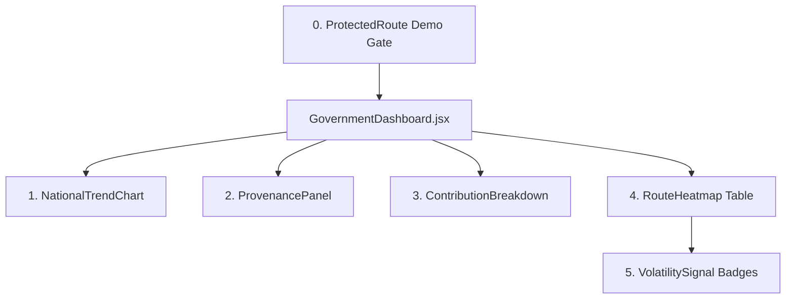

# Implementation Plan — Government Dashboard (Frontend Only)

Build the dedicated **Government & Policymaker Dashboard** ("*What is airfare inflation doing, and why?*") as a seamless, high-trust addition to the APIx frontend application, adhering to the visual design language of [MethodologyTab.jsx](file:///c:/Users/a6644/OneDrive/Documents/AirLine/frontend/src/components/MethodologyTab.jsx).

---

## User Review Required

> [!IMPORTANT]
> - **Frontend-Only Architecture**: Zero backend modifications. All data is managed through a centralized client ([govClient.js](file:///c:/Users/a6644/OneDrive/Documents/AirLine/frontend/src/api/govClient.js)). Real live endpoints will be leveraged where they exist (`/api/index/daily`, `/api/index/heatmap`), while missing endpoints (`/index/national` MoM/YoY historical series, `/provenance`, `/index/contribution`) are cleanly stubbed with explicit `// MOCK DATA` comments.
> - **Component-by-Component Staging**: Components will be built and verified individually in sequence rather than all at once.
> - **Demo-Only Auth**: A lightweight `<ProtectedRoute>` component gates access with a demo PIN/credential dialog (clearly documented in code as demo-only).

---

## Step-by-Step Implementation Sequence

### 1. Shared Foundation
1. **Centralized API Client Layer** (`frontend/src/api/govClient.js`):
   - Single source of truth for all Government Dashboard data fetching.
   - Wraps:
     - `getNationalIndexTrend(mode: 'MoM' | 'YoY')`: Fetches `/index/national` or returns formatted historical baseline.
     - `getProvenanceStats()`: Returns route-level sample sizes and scrape success rates.
     - `getRouteContribution()`: Returns per-route sub-index contributions to the composite move.
     - `getRouteHeatmapData()`: Fetches `/index/heatmap` with fallback enrichment for MoM/YoY.
2. **Generic Reusable TrendChart** (`frontend/src/components/common/TrendChart.jsx`):
   - Modular Recharts LineChart parameterized by `data`, `dataKey`, `xKey`, `yDomain`, `unit`, and an interactive `MoM / YoY` toggle. Designed to be reused for the national trend and later on the citizen dashboard.

---

### 2. Dashboard Components (Step-by-Step Build Order)



#### Step 0: Demo-Only Authentication (`ProtectedRoute.jsx`)
- Gated entry for the Government tab (e.g. `MoSPI / DGCA Access Portal`).
- Allows 1-click demo login / PIN unlock with explicit `// DEMO-ONLY AUTH — Not for production access control` disclaimer.

#### Step 1: `NationalTrendChart.jsx`
- Uses generic `TrendChart`.
- Displays the national aggregate Laspeyres index trajectory over time with **MoM** vs. **YoY** perspective toggles, confidence band, and base period annotations.

#### Step 2: `ProvenancePanel.jsx`
- Compact, high-trust statistics strip above the tables:
  - Total quotes audited today, Scrape Success Rate (e.g., 98.4%), and per-route sample size breakdown.
  - Sourced from run log specifications for transparent government auditability.

#### Step 3: `ContributionBreakdown.jsx`
- Ranked horizontal/vertical bar chart showing which specific routes (e.g. `DEL-BOM`, `DEL-BLR`, `CCU-DEL`) are the primary contributors driving the latest month's index movement.
- Uses the mathematical formula: $\text{Contribution}_i = W_i \times \Delta P_i$.

#### Step 4: `RouteHeatmap.jsx` (Sortable Clean Table)
- High-density, audit-ready data table listing all tracked routes with:
  - Corridor name & DGCA Weight ($W_i$)
  - Current Median Fare (₹)
  - Month-over-Month Change ($\Delta$ MoM %)
  - Year-over-Year Change ($\Delta$ YoY %)
  - Directional color-coding (red for spikes, green for easing).

#### Step 5: `VolatilitySignal.jsx`
- Embedded in the Route Table rows.
- Displays risk badges: `STABLE` (Green), `ELEVATED` (Yellow), or `HIGH VOLATILITY / MONOPOLY RISK` (Orange/Red) based on price dispersion across carrier quotes.
- Includes `// TODO: pending backend calc` comment for fields awaiting deeper pipeline computation.

---

## File Organization Plan

```
frontend/src/
├── api/
│   ├── client.js          # (Existing client preserved)
│   └── govClient.js       # [NEW] Centralized government dashboard client
├── components/
│   ├── common/
│   │   └── TrendChart.jsx # [NEW] Generic reusable line chart with MoM/YoY switch
│   ├── gov/
│   │   ├── ProtectedRoute.jsx         # [NEW] Demo auth gate
│   │   ├── NationalTrendChart.jsx     # [NEW] Component 1
│   │   ├── ProvenancePanel.jsx        # [NEW] Component 2
│   │   ├── ContributionBreakdown.jsx  # [NEW] Component 3
│   │   ├── RouteHeatmap.jsx           # [NEW] Component 4 (Sortable Table)
│   │   └── VolatilitySignal.jsx       # [NEW] Component 5 (Risk Badges)
│   ├── GovernmentDashboard.jsx        # [NEW] Main Gov portal container
│   ├── Header.jsx                     # [MODIFY] Add Government Portal navigation tab
│   └── ... (Existing OverviewTab, LiveDataTab, MethodologyTab, AboutTab untouched)
└── App.jsx                            # [MODIFY] Mount GovernmentDashboard tab
```

---

## Verification Plan

### Automated Verification
- Run `npm run build` in `frontend/` after each step to confirm 0 compilation/lint errors.

### Step-by-Step Visual Verification
1. **Foundation & Auth**: Verify `govClient.js`, `TrendChart.jsx`, and `<ProtectedRoute>` unlock flow.
2. **Component 1**: Render and verify `NationalTrendChart` with MoM/YoY toggle.
3. **Component 2**: Render and verify `ProvenancePanel` sample size & audit strip.
4. **Component 3**: Render and verify `ContributionBreakdown` bar chart ranking.
5. **Component 4 & 5**: Render and verify `RouteHeatmap` sortable table with embedded `VolatilitySignal` badges.
6. **Regression Check**: Verify that all original tabs (**Overview**, **Live Data**, **Methodology**, **About**) continue functioning flawlessly.
